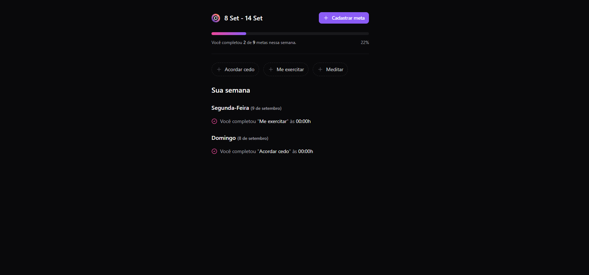

# Trilha FullStack Intermediário - Evento NLW Pocket 

Nesse evento, criamos um gerenicador de metas chamado "in.orbit"! 

## Tecnologias Utilizadas:

### Backend:

    
    
    

### Frontend:

    
    
    

1. Página Inicial (sem metas cadastradas):
   

2. Página para cadastrar metas:
   

3. Páginas para visualizar as suas metas:

